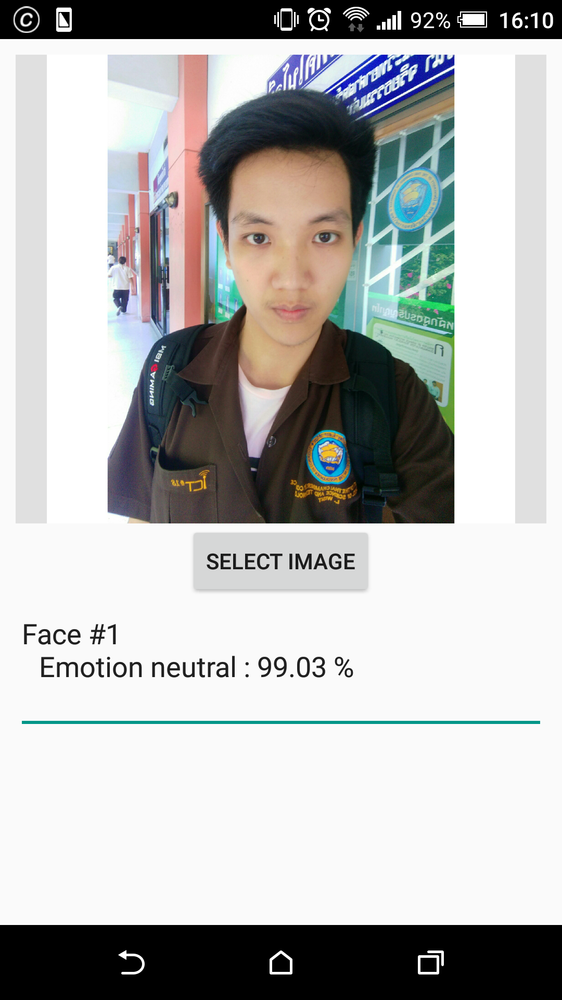
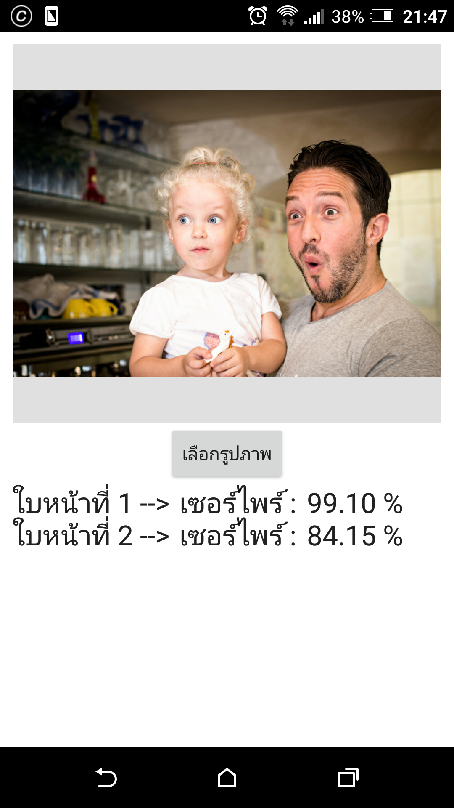
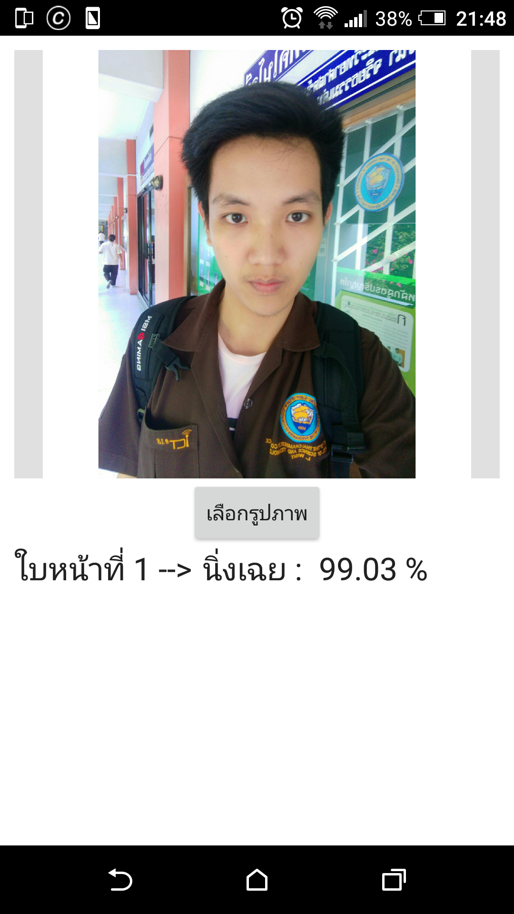

# FaceEmotion (DetectorEmoKan)
Android App 

Face Emotion with Microsoft Emotion API and SDK

Subport minimum android 4.4.4 

> Install versions english /apk/FaceEmotion_1.0.apk

> https://github.com/HomeRuk/FaceEmotion/blob/master/apk/FaceEmotion_1.0.apk

> or

> ติดตั้ง เวอร์ชันไทย /apk/FaceEmotion_1.1.apk

> https://github.com/HomeRuk/FaceEmotion/blob/master/apk/FaceEmotion_1.1.apk

> ติดตั้ง เวอร์ชันไทย2 /apk/FaceEmotion_1.2.apk

> https://github.com/HomeRuk/FaceEmotion/blob/master/apk/FaceEmotion_1.2.apk

# Detail Emotion 
> Emotion display percent > 60 แสดงอารมณ์ความรู้สึกเมือมีความรู้สึกนั้น มากกว่า60 %
- anger โกรธ 
- contempt กำลังดูถูกคน
- disgust รังเกียจ
- fear กลัว 
- happiness มีความสุข 
- neutral นิ่งเฉย 
- sadness โศกเศร้า 
- surprise เซอร์ไพร์ 

# Photo versions english

 

# รูปเวอร์ชันไทย

 

Write by Wisit lertsaimarn  (Ruk)
